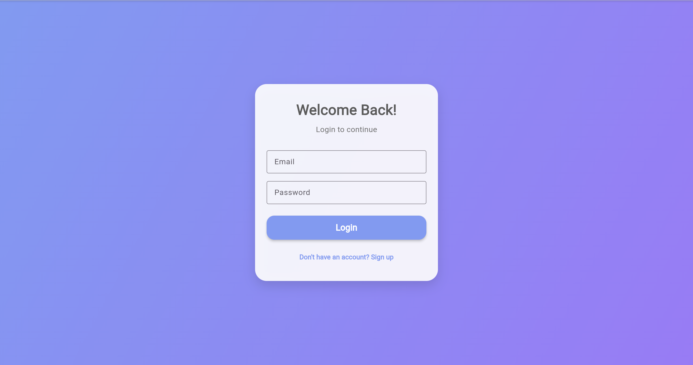
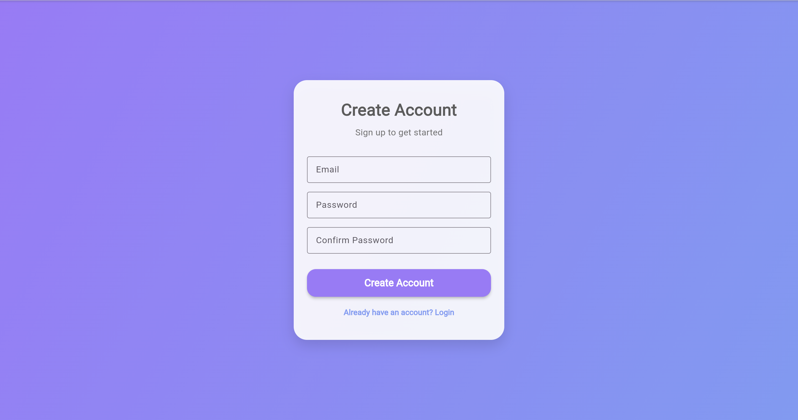
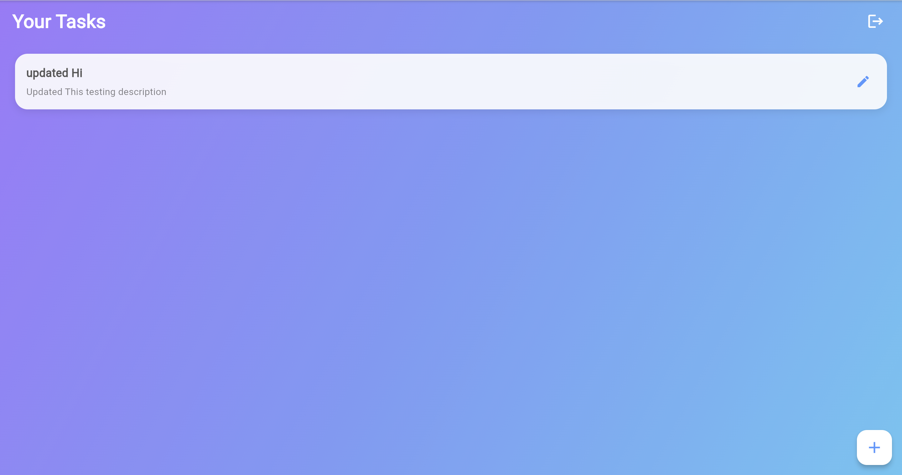
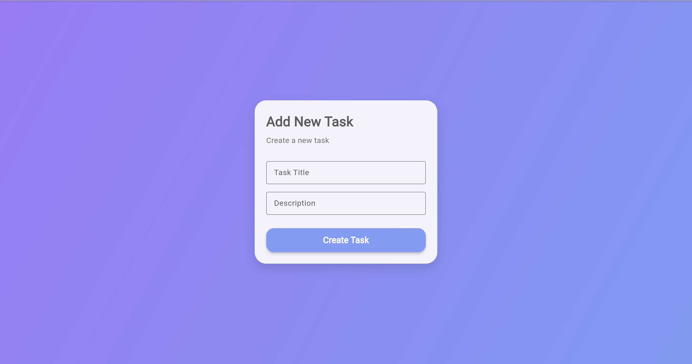
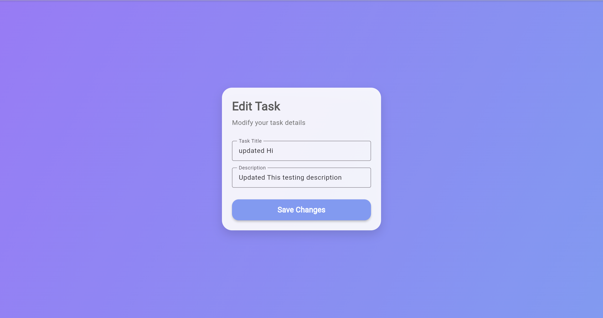

# Flutter Task Manager App (Flutter + Back4App)


A **Task Manager Application** built using **Flutter** with **Back4App** as the backend.  
The app supports **user authentication** and **task CRUD operations**, all fully synced to a cloud backend—without building your own server.

---

## Table of Contents
- [ Features](#-features)
- [ Screens](#-screens)
- [ Tech Stack](#️-tech-stack)
- [ Project Structure](#-project-structure)
- [ Setup Instructions](#️-setup-instructions)
- [ Back4App Setup](#️-back4app-setup)
- [ API Integration](#-api-integration)
- [ Learnings](#-learnings)
- [ License](#-license)
- [ Feedback](#-feedback)

---

##  Features
-  **User Authentication** (Signup/Login)
-  **Task Management** (Create, Read, Update, Delete)
-  **Cloud Backend Integration** using Back4App
-  **Beautiful & Responsive UI**
-  **Pull-to-Refresh + Smooth Navigation**
-  **Cross-Platform Support** (Android, iOS, Web, Desktop)

---

##  Screens
### Login Screen:


### Signup Screen:


### Home Screen:


### Add Screen:


### Edit Screen:



---

## Tech Stack
| Layer | Technology |
|-------|------------|
| **Frontend** | Flutter (Dart) |
| **Backend** | Back4App  |
| **Database** | Back4App NoSQL Cloud DB |
| **Auth** | Parse User API |
| **API** | REST API |

---

##  Project Structure

lib/<br>
├── main.dart<br>
├── screens/<br>
│ ├── login_screen.dart<br>
│ ├── signup_screen.dart<br>
│ ├── home_screen.dart<br>
│ └── add_edit_task_screen.dart<br>
├── services/<br>
│ └── back4app_service.dart<br>
└── widgets/<br>
└── custom_textfield.dart<br>


---

## Setup Instructions

### 1. Install Flutter  
https://docs.flutter.dev/get-started/install

### 2. Clone the Repository
```bash
git clone https://github.com/your-username/task-manager-flutter.git
cd task-manager-flutter
```

### 3. Install Dependencies
```bash 
flutter pub get
```
### 4. Add Back4App Keys
Open:
```bash 
lib/services/back4app_service.dart
```
Replace:
```bash 
static const String appId = "YOUR_APP_ID";
static const String apiKey = "YOUR_REST_API_KEY";
static const String serverUrl = "https://parseapi.back4app.com";
```

### 5. Run the App
```bash 
flutter run -d chrome
```

## Back4App Setup
* Create Account
https://www.back4app.com/
*  Create New App → Backend App
* Copy API Keys
    Navigate:
    App Settings → Security & Keys
    Copy:
    Application ID
    REST API Key
    Server URL
* Create Database Class
```bash 
Class Name: Task
Field	Type	Description
title	String	Task title
description	String	Task details
owner	Pointer → _User	User who owns the task
```
### Class Permissions
```bash 
Public Read: 
Authenticated Write: 
```

### API Integration (Back4App REST API)
```bash 
Action	Method	Endpoint
Signup	POST	/users
Login	GET	/login
Create Task	POST	/classes/Task
Fetch Tasks	GET	/classes/Task
Update Task	PUT	/classes/Task/{id}
Delete Task	DELETE	/classes/Task/{id}
```
All requests include:
```bash 
X-Parse-Application-Id
X-Parse-REST-API-Key
X-Parse-Session-Token

```